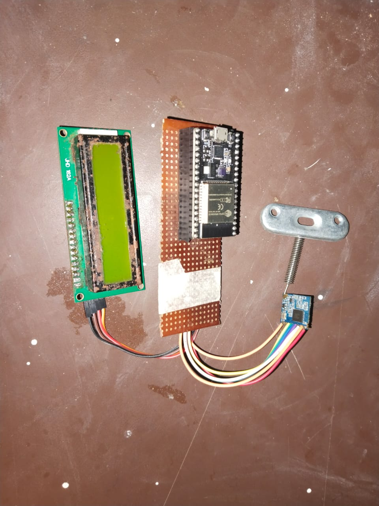
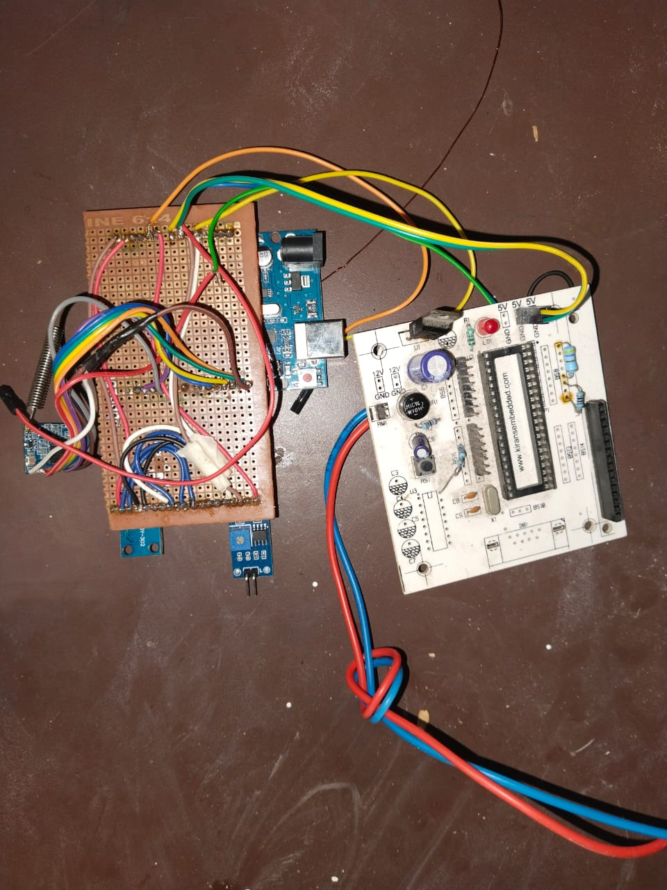
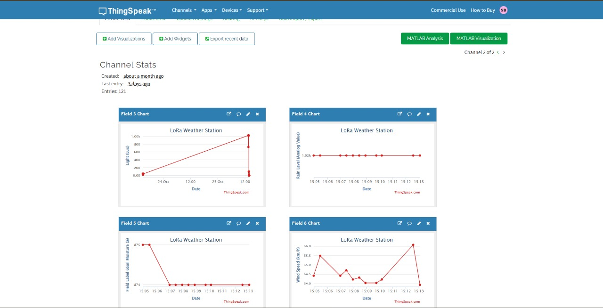

# LoRa-Based Cloud-Integrated Weather Monitoring System

This project collects real-time temperature and humidity readings using LoRa-based wireless communication. The data is displayed on a 16×2 LCD and simultaneously pushed to a cloud platform for remote monitoring through a web/mobile interface.

## 🔧 Features
- Long-range wireless transmission using LoRa  
- Real-time sensor data collection (Temperature & Humidity)  
- 16×2 LCD live display  
- Cloud integration for remote access  
- Upgraded academic project with improved architecture  

## 📘 Description
Designed and upgraded a LoRa-based wireless weather monitoring system capable of capturing and transmitting environmental data over long distances. Integrated the device with cloud storage so that the data can be accessed remotely through mobile or web dashboards.

## 🧩 Responsibilities
- Interfaced sensors with the microcontroller  
- Implemented LoRa communication for long-range data transfer  
- Displayed real-time data on LCD  
- Integrated backend with cloud platform  
- Built a simple dashboard for viewing data remotely  

## 🛠️ Hardware Components
- LoRa Module  
- Microcontroller  
- Temperature/Humidity Sensors  
- 16×2 LCD  
- Power Module

## 📸 Hardware Implementation

### Transmitter Unit

### Receiver Unit

## 📊 Cloud Dashboard (ThingSpeak)

SYSTEM ARCHITECTURE

The project consists of two main units:

----------------------------------------------------
1. TRANSMITTER UNIT (Sensor Node)
----------------------------------------------------
• Arduino Uno (main controller)
• Sensors connected:
    - Rain Sensor
    - Soil Moisture Sensor
    - LDR (Light Sensor)
    - BMP280 (Temperature & Pressure Sensor)
    - Anemometer (Wind Speed Sensor)
• LoRa SX1278 Transmitter Module
• Power Supply / Battery

Data Flow:
Sensors → Arduino Uno → LoRa Transmitter

----------------------------------------------------
2. RECEIVER UNIT (Gateway Node)
----------------------------------------------------
• ESP32-S Microcontroller (with Wi-Fi)
• LoRa SX1278 Receiver Module
• LCD / OLED Display for local visualization
• Cloud Platform (ThingSpeak)

Data Flow:
LoRa Receiver → ESP32-S → LCD Display → ThingSpeak Cloud

----------------------------------------------------
3. OVERALL SYSTEM WORKFLOW
----------------------------------------------------
Sensor Data → LoRa TX → LoRa RX → ESP32 Processing → Display → Cloud Upload

## 🌐 Cloud Integration
Sensor → LoRa → Microcontroller → Cloud → Remote Dashboard

## 📁 Project Status
Upgraded academic project with cloud-enabled capabilities.

## 🔗 Portfolio
Live Portfolio: https://suryaprakash-bandoju.github.io
